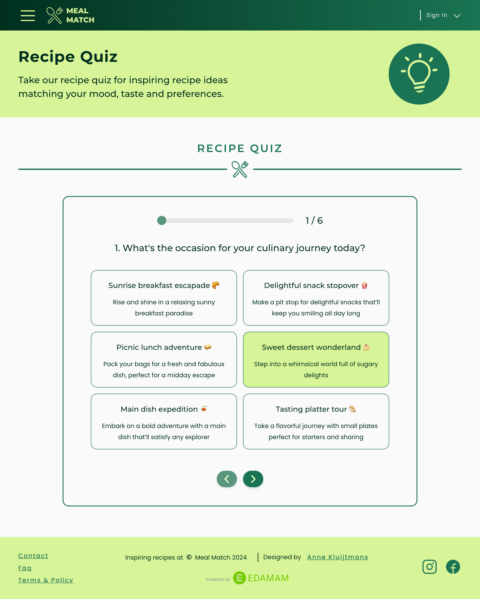
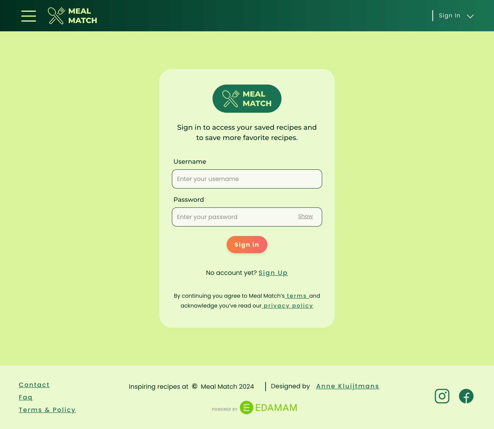
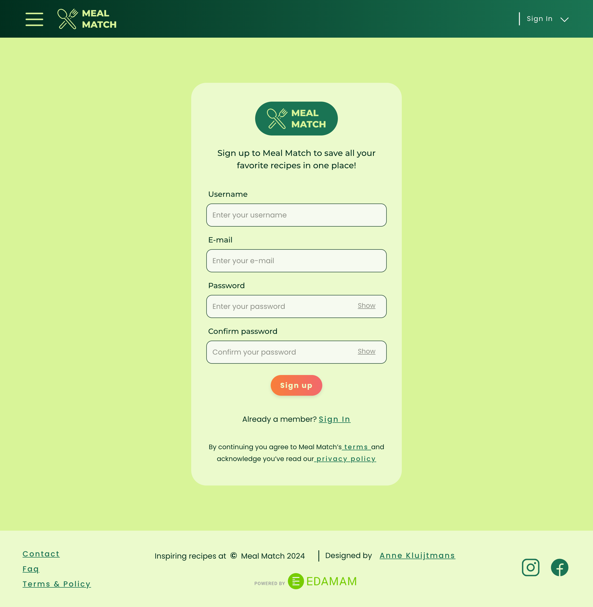
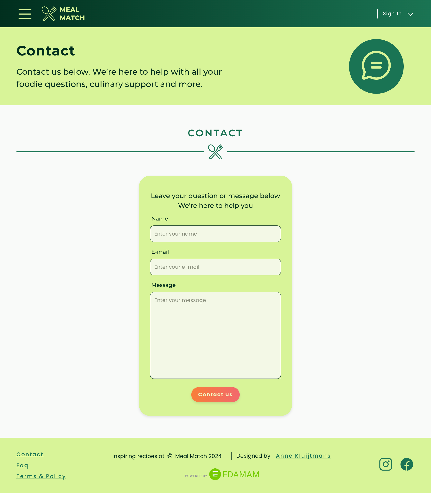
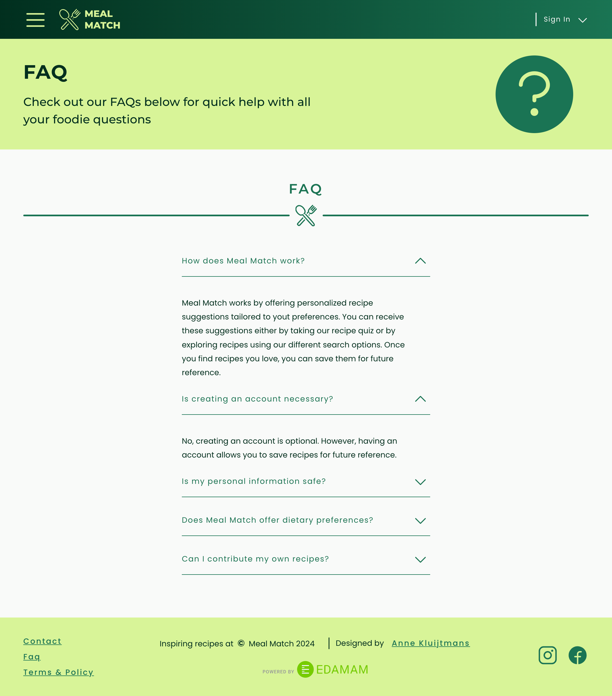
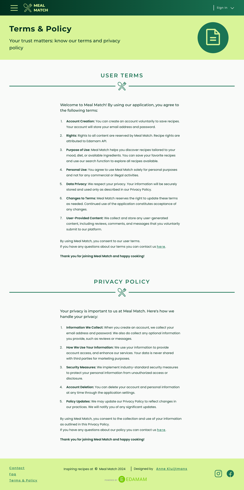
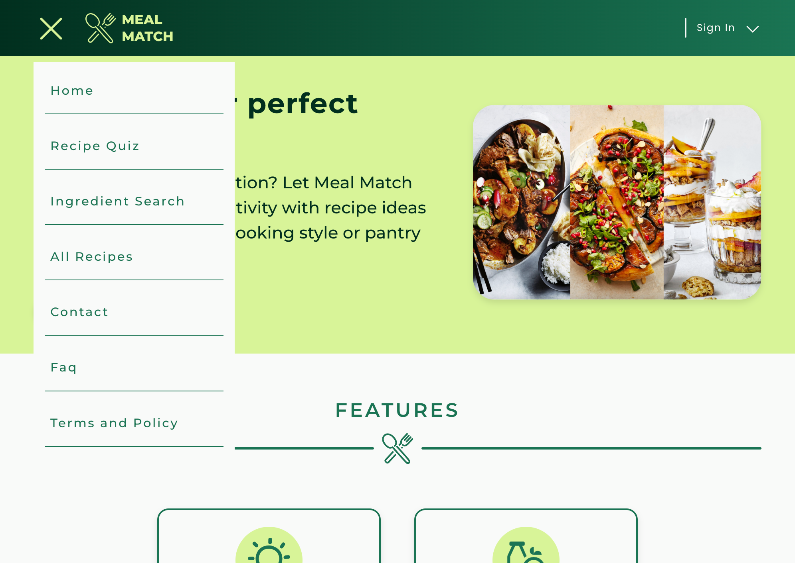

#  Meal Match - Frontend Final Assignment

## About The Project

This repository contains the frontend code for **Meal Match**, my final project for the frontend development module at [Novi University](https://www.novi.nl).
Meal Match is an interactive recipe discovery application designed to overcome the all-too-common problem of a *cooking inspiration crisis*. Whether you lack ideas, have limited ingredients available, or simply don’t know where to start, Meal Match helps you discover new and exciting meals tailored to your needs.

The application provides personalized recipe suggestions based on your mood, dietary preferences, available ingredients, or simply by browsing freely through recipes. With an interactive quiz, search features, and filter options, cooking becomes a fun and creative experience again. Users can also save their favorite recipes in a personal account, making it easy to revisit them later.

---

## Table of contents

- [Tech Stack](#tech-stack)
- [Key Features](#key-features)
- [Preview](#preview)
- [Getting Started](#getting-started)
- [How To Run](#how-to-run)
- [Available Scripts](#available-scripts)
- [Acknowledgements](#acknowledgements)
- [Author](#author)

---

## Tech Stack
- **React** (v18.2.0)
- **Vite**
- **React Router**
- **Axios** (for API requests)
- **Jwt Decode**
- **HTML5**
- **CSS3**
- **JavaScript ES6+**
- **Node.js** & **NPM**

---

## Key Features

- 🔑 **User Authentication**
    - Register a new account, log in securely, and log out when finished.
    - Error handling for incorrect login credentials or mismatched passwords.

- 🎲 **Recipe Quiz**
    - Answer a set of questions to receive up to **12 personalized recipe suggestions**.
    - Ability to go back and adjust previous answers.
    - Clear error handling when no matching recipes are found.

- 🥕 **Ingredient-based Search**
    - Enter one or more ingredients to discover up to **20 recipes** that include them.
    - Input validation for invalid ingredients.

- 🕵️ **Browse Recipes**
    - Scroll through recipes.
    - Apply filters and sorting options to refine results.
    - Clear feedback when no results match the applied filters.

- ❤️ **Favorites**
    - Save favorite recipes to a personal account.
    - Revisit and manage saved recipes at any time.

---

## Preview

<details>
<summary><strong>Home</strong></summary>  


</details>  

<details>
<summary><strong>Recipe Quiz</strong></summary>  


</details>  

<details>
<summary><strong>Ingredient Search</strong></summary>  


</details>  

<details>
<summary><strong>All Recipes</strong></summary>  


</details>  

<details>
<summary><strong>Sign In</strong></summary>  


</details>  

<details>
<summary><strong>Sign Up</strong></summary>  


</details>  

<details>
<summary><strong>Contact</strong></summary>  


</details>  

<details>
<summary><strong>FAQ</strong></summary>  


</details>  

<details>
<summary><strong>Terms & Policy</strong></summary>  


</details>  

<details>
<summary><strong>Mobile</strong></summary>  


</details> 

<details>
<summary><strong>Hamburger menu</strong></summary>  


</details>  


---

## Getting Started

### Prerequisites

To run this application, you will need the following:
- Download and install [Node.js](https://nodejs.org/)
- Download and install the latest version of [npm](https://www.npmjs.com/) 
    ```npm install -g npm@latest```
- A runtime environment such as WebStorm or Visual Studio Code.

### API Variables

Meal Match uses the Edamam API, Novi Backend API, and EmailJS for its functionality. You will need to set the following 
environment variables in a `.env` file in the root of the project:

```env
# API variables:
VITE_API_KEY_AUTH=your-api-key-here
VITE_API_KEY_EDAMAM=your-api-key-here
VITE_API_ID_EDAMAM=your-app-id-here

# EmailJS variables:
VITE_EMAILJS_SERVICE_ID=your-service-id-here
VITE_EMAILJS_TEMPLATE_ID=your-template-id-here
VITE_EMAILJS_USER_ID=your-user-id-here
```

You can follow these links to create the needed API keys and App id's:
- Auth API key --> [Novi Backend](https://novi.datavortex.nl/)  
- Edamam API key and App id --> [Edamam API](https://developer.edamam.com/edamam-recipe-api)
- EmailJS id's --> [EmailJS](https://www.emailjs.com/)

---

## How To Run

1. Clone or open the repository & the server repository (git@github.com:AnneKluytmans/novi-frontend-react-banana-security-server.git) in an IDE

2. Install dependencies in both projects
   ```bash
   npm install
   ```

3. Create a `.env` file in the root of the project and add your API keys and App Id's as mentioned in the [API variables](#api-variables) section.

4. Run the application with
   ```bash
   npm run dev
   ```
5. Open your browser at http://localhost:5173 to view the app.

---

## Available Scripts

You can run the following npm scripts:
- ```npm run dev``` Starts running the development server
- ```npm run build``` Builds the application for production to the build folder
- ```npm run lint``` Lints the project files using ESLint
- ```npm run preview``` Previews the production build locally

---

## Acknowledgements
- [Delicious NL](https://deliciousmagazine.nl/): Provided the food images on the home page.
- [EmailJS](https://www.emailjs.com/): Manages email functionality for the contact form of the application.
- [Novi Backand API](https://novi.datavortex.nl/): Handles authentication and other user related backend services.
- [Edamam API](https://developer.edamam.com/edamam-recipe-api): Provides all the recipe data.

  

Special thanks to Hogeschool Novi for the lessons and support for the development of this project.

---

## License

> "This project is for **educational purposes only**. All images, designs, and dummy content are to be used for learning and non-commercial use."

---

## Author
> "This project was developed by [Anne Kluytmans](https://github.com/AnneKluytmans), a Software Development student at [NOVI](https://www.novi.nl/)."